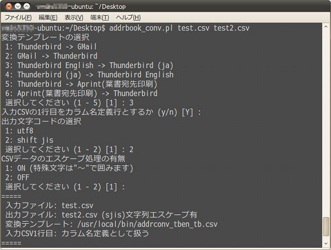

## 住所録CSVファイル相互変換 (Linux, Perlスクリプト)<br />Address Book CSV converter<!-- omit in toc -->

[Home](https://oasis3855.github.io/webpage/) > [Software](https://oasis3855.github.io/webpage/software/index.html) > [Software Download](https://oasis3855.github.io/webpage/software/software-download.html) > [linux-scripts](../) > ***addressbook_converter*** (this page)

<br />
<br />

Last Updated : Dec. 2011

- [ソフトウエアのダウンロード](#ソフトウエアのダウンロード)
- [概要](#概要)
  - [このスクリプトで出来ること](#このスクリプトで出来ること)
- [動作確認済み](#動作確認済み)
  - [入力・出力アドレスブックの検証](#入力出力アドレスブックの検証)
  - [OS](#os)
- [変換テンプレートファイルの書式](#変換テンプレートファイルの書式)
  - [例 1](#例-1)
  - [例 2](#例-2)
- [バージョン情報](#バージョン情報)
- [ライセンス](#ライセンス)

<br />
<br />

## ソフトウエアのダウンロード

-    [このGitHubリポジトリを参照する（ソースコード）](../addressbook_converter/) 

## 概要

Thunderbird、GMailの住所録（アドレス帳や連絡先とも呼ばれる）からエクスポートしたCSVファイルの形式を相互変換するためのスクリプト。変換ルールは、定義ファイルを作ることでユーザの使っている住所録管理ソフトにも対応することも出来ます。 

### このスクリプトで出来ること

- 日本語版Thunderbird形式CSVからGMail形式CSVに変換
- 日本語版Thunderbird形式CSVと英語版Thunderbird形式CSVの相互変換
- GMail形式CSVから日本語版Thunderbird形式CSVに変換
- 日本語版Thunderbird形式CSVから封書・はがきの宛名印刷ソフト[Aprint (Windows版)](http://www.vector.co.jp/soft/winnt/writing/se130034.html) 形式CSVに変換




スクリプトの実行中画面例 

## 動作確認済み

### 入力・出力アドレスブックの検証

- Thunderbird 8.0 (Linux版)
- GMail 2011年11月
- Aprint 11.02 (Windows版) 

### OS

- Linux/BSD（WindowsでもPerl実行環境が有れば可）

## 変換テンプレートファイルの書式

- 1カラム目は出力ファイルのカラム名です
- 2カラム目は入力ファイルから抽出する「式」です。「式」には入力ファイルのカラム名、「+」を用いて複数のカラムを結合できます。また「半角空白文字」を「カラム1+ +カラム2」のように用いて結合時に空白文字を入れることが出来ます。
- 2カラム目の先頭文字に「#」を付けると、「式」ではなく「コメント文字列」と扱われます。コメント文字列はそのまま出力ファイルに出力されます。
- 2カラム目の先頭文字に「=」を付けると、式の解釈がカラム名ではなく「0から始まるカラム数値」になります。この場合、スクリプト実行時に「入力CSVの1行目をカラム名定義行とするか (y/n)」の選択で「N」を入力する必要があります。 

### 例 1

例えば、次のような変換テンプレートファイルを用いた場合

```CSV
姓,Family Name
名,Given Name
表示名,Family Name+Given Name
,#コメント
```

入力ファイル

```CSV
Given Name,Family Name,Address 1,Address 2
太郎,山田,名古屋市中区,三の丸2丁目
```

出力ファイル

```CSV
姓,名,表示名,,
山田,太郎,山田太郎,コメント,
```

### 例 2

また、次のような変換テンプレートの場合

```
姓,=1
名,=0
表示名,=0+ +1
```

出力ファイル

```
姓,名,表示名,
山田,太郎,山田 太郎,
```

というような処理になります。 

## バージョン情報

- Version 0.1 (2011/Nov/27)
- Version 0.2 (2011/Dec/08)

## ライセンス

このスクリプトは [GNU General Public License v3ライセンスで公開する](https://gpl.mhatta.org/gpl.ja.html) フリーソフトウエア


