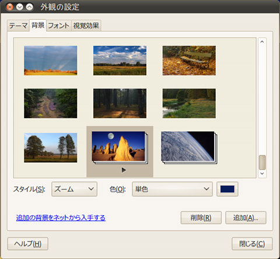

## Gnomeデスクトップ壁紙 スライドショー XML作成 (Linux Perlスクリプト)<br />Gnome background image slideshow XML creater<!-- omit in toc -->

[Home](https://oasis3855.github.io/webpage/) > [Software](https://oasis3855.github.io/webpage/software/index.html) > [Software Download](https://oasis3855.github.io/webpage/software/software-download.html) > [linux-scripts](../README.md) > ***gnome-desktop-img-XMLmaker*** (this page)

<br />
<br />

Last Updated : Apr. 2011 -- ***this is discontinued software 開発終了***

- [ソフトウエアのダウンロード](#ソフトウエアのダウンロード)
- [概要](#概要)
- [動作確認済み](#動作確認済み)
- [作成される壁紙スライドショーXMLファイルの例](#作成される壁紙スライドショーxmlファイルの例)
- [参考資料](#参考資料)
- [バージョン情報](#バージョン情報)
- [ライセンス](#ライセンス)

<br />
<br />

## ソフトウエアのダウンロード

-     [このGitHubリポジトリを参照する（ソースコード）](../gnome-desktop-img-xmlmaker/)


## 概要

Gnomeデスクトップ壁紙（画像）のスライドショー機能を使うためのXMLファイルを作成するPerlスクリプト



Gnome外観の設定 - デスクトップ背景の選択で、スライドショー壁紙を選択している画面


## 動作確認済み

- Ubuntu 10.04

## 作成される壁紙スライドショーXMLファイルの例

```XML
<background>
 <starttime>
  <year>2011</year>
  <month>01</month>
  <day>01</day>
  <hour>00</hour>
  <minute>00</minute>
  <second>00</second>
 </starttime>
 <static>
  <duration>300</duration>
  <file>/usr/share/backgrounds/BosqueTK.jpg</file>
 </static>
 <transition>
  <duration>2</duration>
  <from>/usr/share/backgrounds/BosqueTK.jpg</from>
  <to>/usr/share/backgrounds/BusquedaNocturna.jpg</to>
 </transition>
 <static>
  <duration>300</duration>
  <file>/usr/share/backgrounds/BusquedaNocturna.jpg</file>
 </static>
 
～ 途中省略 ～
 
 <transition>
  <duration>2</duration>
  <from>/usr/share/backgrounds/space-05.jpg</from>
  <to>/usr/share/backgrounds/BosqueTK.jpg</to>
 </transition>
</background>
```

## 参考資料

-  /usr/share/backgrounds/cosmos/background-1.xml （Gnomeの標準壁紙の設定ファイル） 
-  [Ubuntu Tips/デスクトップ環境/複数の壁紙を一定時間ごとに表示するには](https://wiki.ubuntulinux.jp/UbuntuTips/Desktop/ChangeBackground)（Ubuntu日本語フォーラム）
-  [Create a Custom Transitioning Background for Your Gnome 2.28 Desktop](https://www.linuxjournal.com/content/create-custom-transitioning-background-your-gnome-228-desktop) （Linux Journal  2009.Dec.04） 

## バージョン情報

- Version 0.1 (2011/Apr/20)

## ライセンス

このスクリプトは [GNU General Public License v3ライセンスで公開する](https://gpl.mhatta.org/gpl.ja.html) フリーソフトウエア

