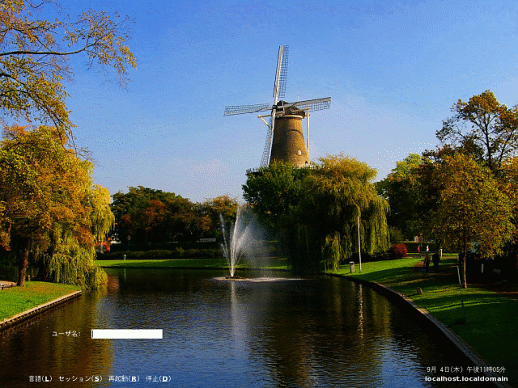

## Gnome 2 ログオンテーマ<br />Gnome 2 Logon theme<!-- omit in toc -->

[Home](https://oasis3855.github.io/webpage/) > [Software](https://oasis3855.github.io/webpage/software/index.html) > [Software Download](https://oasis3855.github.io/webpage/software/software-download.html) > [linux-scripts](../README.md) > ***gnome2_logon_theme*** (this page)

<br />
<br />

Last Updated : Sep. 2008  -- ***this is discontinued software 開発終了***

- [ソフトウエアのダウンロード](#ソフトウエアのダウンロード)
- [概要](#概要)
- [動作確認](#動作確認)
- [インストール方法](#インストール方法)
- [カスタマイズ方法](#カスタマイズ方法)
  - [文字の表示位置の調整](#文字の表示位置の調整)
  - [ユーザ名やパスワードを入力するインプット ボックス表示位置の調整](#ユーザ名やパスワードを入力するインプット-ボックス表示位置の調整)
- [バージョンアップ履歴](#バージョンアップ履歴)
- [ライセンス](#ライセンス)

<br />
<br />

## ソフトウエアのダウンロード

-     [このGitHubリポジトリを参照する（ソースコード）](../gnome2_logon_theme/)
-     [Google ドキュメントを参照する（ソースコード）](https://docs.google.com/open?id=0B7BSijZJ2TAHYzFlYjE3YzQtZWNlMC00MDdiLTgxZDgtZWI0NDAwMmEwNjk1)

## 概要

Gnome 2 ログオンテーマで任意の画像を用いるサンプル例です



ログオン画面 （オランダのライデン旧市街を取り囲む環壕にある風車[De Valk](https://en.wikipedia.org/wiki/Museum_De_Valk)）

## 動作確認

- CentOS 5（Gnome 2デスクトップ） 

## インストール方法

Gnome システムメニューの、管理 → ログイン画面のダイアログよりインストールします。（解凍せずに、配布したファイルそのままをインストール時に指定します） 

##  カスタマイズ方法

利用しているマシンの解像度や色深度、言語設定によってうまく表示されない場合は、XMLファイルを編集したり、画像ファイルの色深度を落としたりすると良いかもしれません。 

テーマ ファイルの文法は、Gnome公式サイトの[Themed Greeter](http://projects.gnome.org/gdm/docs/2.16/thememanual.html)に詳しい解説が掲載されています。 

### 文字の表示位置の調整

```XML
<item type="rect">
    <pos y="20%" x="100" width="50" height="50" anchor="ne"/>
    <box>
        <item type="label">
            <normal font="Sans 10" color="#ffffff"/>
            <text>テスト文字列</text>
        </item>
    </box>
</item>
```

位置は、画面左上からの距離になり、単位が無いときはピクセル数、"%"を付けたときは画面割合となります。

anchor属性には、オブジェクトのどこを指定された座標位置に合わせるかを指定するものです。"nw" はオブジェクトの左上（n=north, w=west）を座標位置にあわせることを示します。ほかに"s"=south, "e"=east, "c"=centre があります。この座標設定さえ分かってしまえば、後は自由自在にオブジェクトを画面上に配置できます。

### ユーザ名やパスワードを入力するインプット ボックス表示位置の調整

```XML
<item type="rect">
    <pos y="85%" x="10%" width="100%" height="50" anchor="nw"/>
    <box>
        <item type="rect">
            <pos y="0" x="0" width="box" height="box" anchor="nw"/>
            <box>
                <item type="label" id="pam-prompt">
                    <pos x="0"/>
                    <normal font="Sans 10" color="#ffffff"/>
                    <stock type="username-label"/>
                </item>
                <item type="entry" id="user-pw-entry">
                    <pos x="20" width="160" height="18"/>
                    <normal font="Sans 10" color="#000000"/>
                    <text/>
                </item>	
            </box>
        </item>
    </box>
</item>
```

「ユーザ名」「パスワード」という文字列を表示するのは、```<item type="label">``` タグです。このタグで囲んだ中に、```<text>``` タグがあればその内容を表示します。しかし、ここでは ローカル言語で表示するために ```<stock type="username-label"/>``` というタグを使っています。日本語環境では「ユーザ名」と表示され、オランダ語環境では「Usernaam」と表示されるのはこのタグを使っているからです。

「インプット ボックス」は、```<item type="entry" id="user-pw-entry">``` タグで表示しています。 

## バージョンアップ履歴

- Version 1.0 (2008/09/14)

## ライセンス

このスクリプトは [GNU General Public License v3ライセンスで公開する](https://gpl.mhatta.org/gpl.ja.html) フリーソフトウエア


