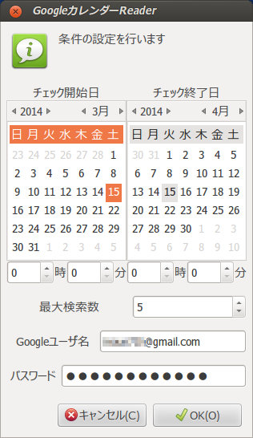
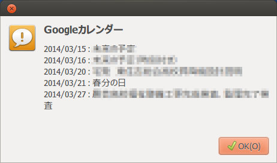
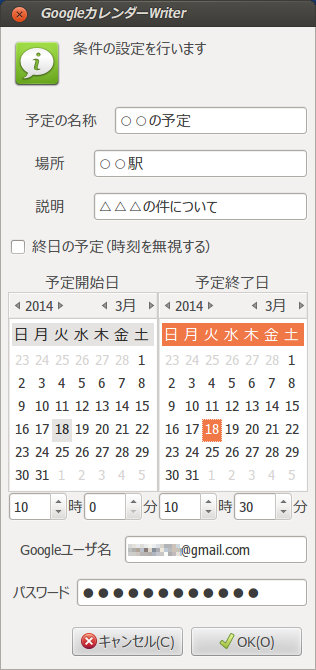
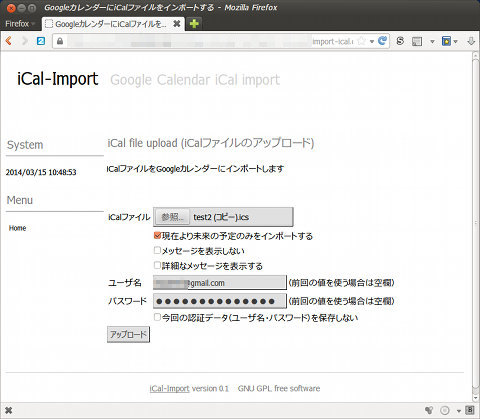

##  Googleカレンダーの読み書きとiCalインポート<!-- omit in toc -->

[Home](https://oasis3855.github.io/webpage/) > [Software](https://oasis3855.github.io/webpage/software/index.html) > [Software Download](https://oasis3855.github.io/webpage/software/software-download.html) > [linux-scripts](../README.md) > ***googlecalendar_readwrite*** (this page)

<br />
<br />

Last Updated : Mar. 2014  **(開発終了 discontinued)**

- [ソフトウエアのダウンロード](#ソフトウエアのダウンロード)
- [概要](#概要)
- [動作環境](#動作環境)
- [Googleカレンダーからの読み出し (google-calendar-read.py)](#googleカレンダーからの読み出し-google-calendar-readpy)
- [Googleカレンダーへの書き込み (google-calendar-insert.py)](#googleカレンダーへの書き込み-google-calendar-insertpy)
- [iCalファイルのGoogleカレンダーへのインポート (google-calendar-import-ical.cgi)](#icalファイルのgoogleカレンダーへのインポート-google-calendar-import-icalcgi)
- [バージョン情報](#バージョン情報)
- [ライセンス](#ライセンス)

<br />
<br />

## ソフトウエアのダウンロード

-    [このGitHubリポジトリを参照する（ソースコード）](../googlecalendar_readwrite/download/) 

<br />
<br />

## 概要

Googleカレンダーから予定を読み出す／書き込むサンプル スクリプト。それぞれgtkダイアログを実装している。

iCal形式で予定を読み出すサンプル スクリプトには、ローカル コマンドライン版と、webインターフェース版を作成。

<br />
<br />

## 動作環境

- Python 2.7以降 (Python 3系では動作しない)

- [Google Data APIs Client Libraries](https://developers.google.com/gdata/docs/client-libraries#client-libraries-provided-by-google)
  - [Python Client Library](http://code.google.com/p/gdata-python-client/)

- gtk GUI版
  - Ubuntu 12.04 LTSで動作確認済み 
- Web版
  - Apache Webサーバ 
  - Ubuntu 12.04 LTSおよびFreeBSD 9.1で動作確認済み

<br />
<br />

## Googleカレンダーからの読み出し (google-calendar-read.py)

<br />


<br/>検索条件の設定

<br />



<br/>検索結果の表示

<br />

コア部分のソースコード例

```python
#!/usr/bin/env python
# -*- coding: utf-8 -*-

import datetime
import gdata.calendar.client

list_schedules = []
try:
    str_date_start = '%4d-%02d-%02d' % (datetime_start.year, datetime_start.month, datetime_start.day)
    str_date_end = '%4d-%02d-%02d' % (datetime_end.year, datetime_end.month, datetime_end.day)

    calendar_service = gdata.calendar.client.CalendarClient()
    calendar_service.ssl = True
    calendar_service.ClientLogin(login_user, login_password, "test python script");

    query = gdata.calendar.client.CalendarEventQuery(start_min=str_date_start, start_max=str_date_end,
                max_results=max_results, orderby='starttime', sortorder='ascending')
    feed = calendar_service.GetCalendarEventFeed(q=query)

    for i,ev in enumerate(feed.entry):
        for e in ev.when:
            dict_schedule = {"title":ev.title.text, "start":e.start, "end":e.end, "updated":ev.updated.text}
            list_schedules.append(dict_schedule)
            break
except:
    # エラー処理

str_message = ""

for list_item in list_schedules:
    time_start_date = parse_datetime_str(list_item["start"])
    str_start_date = "%4d/%02d/%02d" % (time_start_date.year, time_start_date.month, time_start_date.day)
    str_message += (str_start_date + " : " + list_item["title"] + "\n")

```

<br />
<br />

##  Googleカレンダーへの書き込み (google-calendar-insert.py)



<br />

コア部分のソースコード例

```python
#!/usr/bin/env python
# -*- coding: utf-8 -*-

import datetime
import gdata.calendar.client

calendar_service = gdata.calendar.client.CalendarClient()
calendar_service.ssl = True
calendar_service.ClientLogin(login_user, login_password, "test python script");

event = gdata.calendar.data.CalendarEventEntry()
event.title = atom.data.Title(text=title)
event.content = atom.data.Content(text=content)
event.where.append(gdata.calendar.data.CalendarWhere(value=place))
if allday == True:
    start_time = '%d-%02d-%02d' % (datetime_start.year, datetime_start.month, datetime_start.day)
    end_time = '%d-%02d-%02d' % (datetime_end.year, datetime_end.month, datetime_end.day)
else:
    start_time = '%d-%02d-%02dT%02d:%02d:00.000' % (datetime_start.year, datetime_start.month,
        datetime_start.day, datetime_start.hour, datetime_start.minute)
    end_time = '%d-%02d-%02dT%02d:%02d:00.000' % (datetime_end.year, datetime_end.month,
        datetime_end.day, datetime_end.hour, datetime_end.minute)
event.when.append(gdata.data.When(start=start_time, end=end_time))

calendar_service.InsertEvent(event)

```

<br />
<br />

## iCalファイルのGoogleカレンダーへのインポート (google-calendar-import-ical.cgi)



iCalファイルの読み込みコア部分を抜き出すと次のようなコードになる。

得られたEventリストを、前出の「Googleカレンダーへの書き込み (google-calendar-insert.py)」に示したコードに投入すれば、Googleカレンダーに書き込むことができる。

```python
#####
# iCalファイルよりEventを読み取り、リストに格納する
# 戻り値 : list_schedules
def read_ical_file(filename):

    # Eventリスト（戻り値）
    list_schedules = []

    # icalファイルをテキスト str_icsdata に格納する
    if 1:
#    try:
        fh = open(filename, "r")
        str_icsdata = fh.read()
        fh.close()
    #except:
        #if flag_silent_stdout == False:
            #print "iCal file open error"
        #return

    # icalファイル「テキスト」を解析し cal に取り込む
    cal = icalendar.Calendar.from_ical(str_icsdata)

    for e in cal.walk():
        if e.name == 'VEVENT' :
            # Eventを1つずつ、辞書形式dict_scheduleに一旦代入し、それをリストlist_schedulesに追加する
            dict_schedule = {"title":unicode(e.decoded("summary"),'utf8') if e.get("summary") else "",
                            "place":unicode(e.decoded("location"),'utf8') if e.get("location") else "",
                            "desc":unicode(e.decoded("description"),'utf8') if e.get("description") else "",
                            "start":e.decoded("dtstart"),
                            "end":e.decoded("dtend"),
                            "updated":e.decoded("dtstamp")
                            }
            list_schedules.append(dict_schedule)

    # 予定表Eventを格納したリストを返す
    return list_schedules
```

<br />
<br />

## バージョン情報

- google-calendar-read.py
  - version 0.1 (2014/03/01)

- google-calendar-insert.py
  - version 0.1 (2014/03/01)

- google-calendar-import-ical.py
  - Version 0.1 (2014/03/03)
  - Version 0.2 (2014/03/12)
  - Version 0.3 (2014/03/14)

- google-calendar-import-ical.cgi
  - Version 0.1 (2014/03/14)

<br />
<br />

## ライセンス

このスクリプトは [GNU General Public License v3ライセンスで公開する](https://gpl.mhatta.org/gpl.ja.html) フリーソフトウエア


