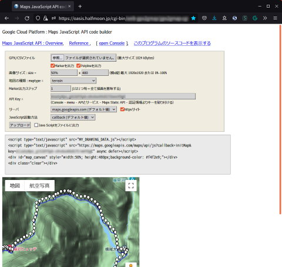
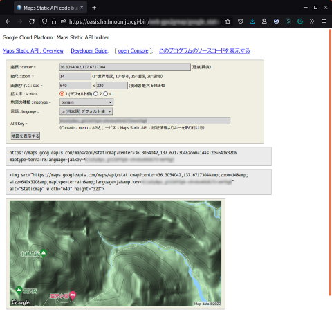

## GPX GPSログファイル 変換ツール類 (Linux, Perlスクリプト)<br />GPX file converter<!-- omit in toc -->

[Home](https://oasis3855.github.io/webpage/) > [Software](https://oasis3855.github.io/webpage/software/index.html) > [Software Download](https://oasis3855.github.io/webpage/software/software-download.html) > [linux-scripts](../) > ***gpx-tools*** (this page)

<br />
<br />

Last Updated : Sep. 2021

- [ソフトウエアのダウンロード](#ソフトウエアのダウンロード)
- [概要](#概要)
  - [Google Cloud Platform : Maps JavaScript API code builder (gpx2gmap.cgi)](#google-cloud-platform--maps-javascript-api-code-builder-gpx2gmapcgi)
  - [Google Cloud Platform : Maps JavaScript API code converter (csv2gmap.pl)](#google-cloud-platform--maps-javascript-api-code-converter-csv2gmappl)
  - [Google Cloud Platform : Maps Static API builder (google_staticmap_maker.cgi)](#google-cloud-platform--maps-static-api-builder-google_staticmap_makercgi)
  - [GPX を CSV に変換 (gpx2csv.pl)](#gpx-を-csv-に変換-gpx2csvpl)
  - [CSV を GPX に変換 (csv2gpx.pl)](#csv-を-gpx-に変換-csv2gpxpl)
- [バージョン情報](#バージョン情報)
- [ライセンス](#ライセンス)

<br />
<br />

## ソフトウエアのダウンロード

-    [このGitHubリポジトリを参照する（ソースコード）](../gpx-tools/) 

## 概要

GPX形式のGPSログファイルを、CSVファイルやGoogle Maps Javascript API形式などに変換するためのスクリプト


### Google Cloud Platform : Maps JavaScript API code builder (gpx2gmap.cgi)

GPXファイルを読み込み、拡大縮小・スクロール可能な地図上にトラックログを表示するGoogle Maps JavaScript API ソースコードを出力するCGI(Perl)スクリプト

このスクリプトはWebサーバ上に設置し、ブラウザで表示・実行する。なお、不特定多数に公開するレベルのセキュリティを満たしていないため、公開Webサーバ上に設置しないこと

また、出力したGoogle Maps JavaScript API ソースコードを表示（実行）するには、Google Cloud PlatformのAPIキーを取得する必要がある



gpx2gmap.cgi の実行画面

**出力されるソースコード例**

```Java
/* Google Cloud Platform : Maps JavaScript API , route plotting map source code */
function initMap() {
 var myOptions = {
 zoom: 16,
 center: new google.maps.LatLng(36.303583,137.674196),
 mapTypeId: 'terrain',
 gestureHandling: 'greedy',  /* enable zoom in/out by mouse wheel */
 };
 var myMap = new google.maps.Map(document.getElementById("map_canvas"), myOptions);


 var marker0 = new google.maps.Marker({
  map: myMap,
  position: new google.maps.LatLng(36.3073749,137.6779323),
  icon: "http://labs.google.com/ridefinder/images/mm_20_white.png",
  title: "time 2016/09/01 09:15:13",
 });
 var infowindow0 = new google.maps.InfoWindow({
  content: "日時 2016/09/01 09:15:13<br/>緯度 36.3073749<br/>経度 137.6779323<br/>高度 1776.54 m",
 });
 google.maps.event.addListener(marker0, 'click', function() {
  infowindow0.open(myMap, marker0);
 });
 var marker1 = new google.maps.Marker({
  map: myMap,
  position: new google.maps.LatLng(36.3073105,137.6777145),
  icon: "http://labs.google.com/ridefinder/images/mm_20_white.png",
  title: "time 2016/09/01 09:16:57",
 });
 var infowindow1 = new google.maps.InfoWindow({
  content: "日時 2016/09/01 09:16:57<br/>緯度 36.3073105<br/>経度 137.6777145<br/>高度 1783.26 m",
 });

 〜 以下省略 〜
```

### Google Cloud Platform : Maps JavaScript API code converter (csv2gmap.pl)

gpx2gmap.cgi のコンソール版。CSVファイルを読み込んで、Maps JavaScript APIのソースコード（.js ファイル）を出力するスクリプト


### Google Cloud Platform : Maps Static API builder (google_staticmap_maker.cgi)

拡大縮小・スクロール***できない***地図画像を作成する Google Maps Static API ソースコードを出力するCGI(Perl)スクリプト

このスクリプトはWebサーバ上に設置し、ブラウザで表示・実行する。なお、不特定多数に公開するレベルのセキュリティを満たしていないため、公開Webサーバ上に設置しないこと

また、出力したGoogle Maps Static API ソースコードを表示（実行）するには、Google Cloud PlatformのAPIキーを取得する必要がある




google_staticmap_maker.cgi の実行画面

**出力されるソースコード例**

```

```

### GPX を CSV に変換 (gpx2csv.pl)

GPXファイルを読み込み、CSV形式で出力するスクリプト

**入力するGPXファイル例**

```XML
<?xml version="1.0" encoding="UTF-8"?>
<gpx xmlns="http://www.topografix.com/GPX/1/1" xmlns:gpxtpx="http://www.garmin.com/xmlschemas/TrackPointExtension/v1" creator="OruxMaps v.6.5.10" version="1.1" xmlns:xsi="http://www.w3.org/2001/XMLSchema-instance" xsi:schemaLocation="http://www.topografix.com/GPX/1/1 http://www.topografix.com/GPX/1/1/gpx.xsd">
	<metadata>
		<name>GpsPruneTrack</name>
		<desc>Export from GpsPrune</desc>
	</metadata>
	<trk>
		<name>GpsPruneTrack</name>
		<number>1</number>
		<trkseg>
<trkpt lat="36.3073749" lon="137.6779323">
<ele>1776.54</ele>
<time>2016-09-01T00:15:13Z</time>
</trkpt>
<trkpt lat="36.3073105" lon="137.6777145">
<ele>1783.26</ele>
<time>2016-09-01T00:16:57Z</time>
</trkpt>
<trkpt lat="36.3073317" lon="137.6774857">
<ele>1786.34</ele>
<time>2016-09-01T00:28:05Z</time>
</trkpt>
<trkpt lat="36.3073169" lon="137.6772399">
<ele>1786.55</ele>
<time>2016-09-01T00:28:41Z</time>
</trkpt>

〜 以下省略 〜
```

**出力されるCSV例**

```CSV
csv.pl test.gpx
convert GPX tracking log into CSV
66 track points is extracted from GPX(XML)
1472688913,36.3073749,137.6779323,1776.54
1472689017,36.3073105,137.6777145,1783.26
1472689685,36.3073317,137.6774857,1786.34
1472689721,36.3073169,137.6772399,1786.55
1472689755,36.3072176,137.6770512,1786.10

〜 以下省略 〜
```

### CSV を GPX に変換 (csv2gpx.pl)

gpx2csv.pl で出力されたCSVファイルを、GPXに変換するスクリプト


## バージョン情報

- 2011/10/25

  - csv2gmap.pl 新規追加
  - gpx2csv.pl 新規追加

- 2011/10/29

  - gpx2gmap.cgi (Webサービス版) 新規追加

- 2015/11/06

  - gpx2gmap.cgi マーカーON/OFF, ラインON/OFF設定追加

- 2018/10/13

  - gpx2gmap.cgi APIキーに対応
  - google_staticmap_maker.cgi (Webサービス版) 新規追加

- 2018/10/24

  - gpx2gmap.cgi 出力コードをhttpsサイト対応化

- 2021/09/19

  - csv2gpx.pl 新規追加

## ライセンス

このスクリプトは [GNU General Public License v3ライセンスで公開する](https://gpl.mhatta.org/gpl.ja.html) フリーソフトウエア


