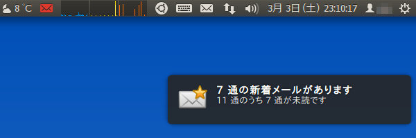
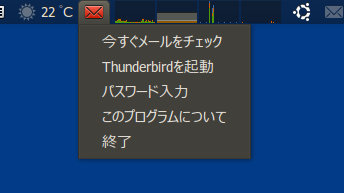
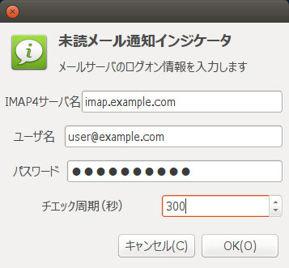

## 未読メール通知Gnomeインジケータ アプレット (Linux)<br />Gnome indicator applet of IMAP4 mail checker<!-- omit in toc -->

[Home](https://oasis3855.github.io/webpage/) > [Software](https://oasis3855.github.io/webpage/software/index.html) > [Software Download](https://oasis3855.github.io/webpage/software/software-download.html) > [linux-scripts](../README.md) > ***imap4_mail_indicator*** (this page)

<br />
<br />

Last Updated : May. 2014

- [ソフトウエアのダウンロード](#ソフトウエアのダウンロード)
- [概要](#概要)
- [動作確認](#動作確認)
- [インストール方法](#インストール方法)
- [バージョンアップ情報](#バージョンアップ情報)
- [ライセンス](#ライセンス)

<br />
<br />

## ソフトウエアのダウンロード

-     [このGitHubリポジトリを参照する（ソースコード）](../imap4_mail_indicator/)

## 概要

Ubuntu LinuxのGnomeパネルまたはUnityパネルの通知領域に常駐する、未読メール通知インジケータです。IMAP4メール サーバとの通信はSSLを用いています。

今まで使っていたMail NotificationアプレットがUnityに完全に対応していなかったため、暫定的に作ったスクリプトです。最低限の機能しか実装していません。
メールサーバやユーザ名などの認証情報は、ホームディレクトリの設定ファイルに保存されますが、パスワードはBase64変換で保存しているだけですので簡単に解読できます。 




未読メールを検出すると、通知アイコンが変化し、ポップアップ表示される 



通知アイコンをクリックするとメニューを表示する 



認証情報の設定ダイアログ 

## 動作確認

-  Ubuntu 10.04
-  Ubuntu 11.10
-  Ubuntu 12.04
-  Ubuntu 14.04
-  Ubuntu 16.04
-  Ubuntu 18.04 

## インストール方法

Ubuntu 〜16.04の場合で、Unityシステムトレイの表示制限を解除していない場合は、Terminal（コマンドプロンプト）で次のようにして表示制限を解除してください。

```Bash
gsettings set com.canonical.Unity.Panel systray-whitelist "['all']"
```

「自動起動するアプリケーションの設定」に登録すると便利です。このソフトウエアのコマンドラインは次のようになります。（スクリプトをおいているディレクトリ名に適宜読み替えてください）

```
python /usr/local/bin/imap4-newmail-indicator.py
```

「自動起動するアプリケーションの設定」に登録する前に、必ず通常のコマンドライン（terminal）で起動して正常に動作するか確認してください。なお、必要なpipライブラリーでappindicatorとpynotifyがインストールされていない場合、sudo pip install ○○ではなく、まずaptコマンドの方でインストールしてください

```
sudo apt-get install python-appindicator
sudo apt-get install python-notify
```

## バージョンアップ情報

- Version 0.1 (2012/03/03)

  -    当初 

- Version 0.2 (2012/05/08)

  -    新規メール到着時に音を鳴らす 
  -    メールソフト実行メニュー追加 

- Version 0.3 (2012/06/08)

  -    設定ファイルに認証情報を分離 

- Version 0.4 (2014/05/10)

  -    チェック周期の任意設定、接続エラー時のダイアログ非表示選択可 


## ライセンス

このスクリプトは [GNU General Public License v3ライセンスで公開する](https://gpl.mhatta.org/gpl.ja.html) フリーソフトウエア

