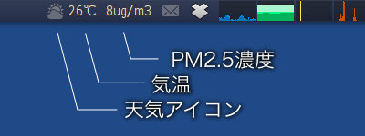
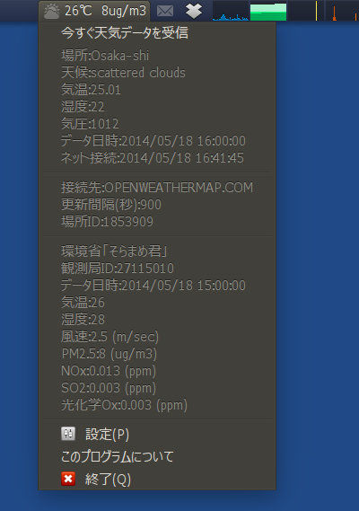
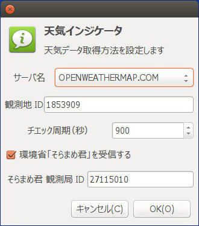

## 天気・気温通知Gnomeインジケータ アプレット (Linux)<br />Gnome indicator applet of Weather<!-- omit in toc -->

[Home](https://oasis3855.github.io/webpage/) > [Software](https://oasis3855.github.io/webpage/software/index.html) > [Software Download](https://oasis3855.github.io/webpage/software/software-download.html) > [linux-scripts](../README.md) > ***weather_indicator*** (this page)

<br />
<br />

Last Updated : May. 2014

- [ソフトウエアのダウンロード](#ソフトウエアのダウンロード)
- [概要](#概要)
- [動作確認済み](#動作確認済み)
- [インストール方法](#インストール方法)
- [バージョンアップ情報](#バージョンアップ情報)
- [ライセンス](#ライセンス)

<br />
<br />

## ソフトウエアのダウンロード

-     [このGitHubリポジトリを参照する（ソースコード）](../weather_indicator/)

## 概要

Ubuntu LinuxのGnomeパネルまたはUnityパネルの通知領域に常駐する、天気・気温インジケータです。Ubuntu 14.04でUbuntu標準リポジトリからインストールされる天気インジケータに不具合があったため、最低限の機能のものを作成した

取得可能な天気データサイト

-    openweathermap.com
-    weather.yahoo.com
-    weather.com
-    環境省 大気汚染物質広域監視システム「そらまめ君」 



パネルに天気アイコンと気温・PM2.5濃度（※）が表示される

※ 環境省「そらまめ君」データ受信を有効にした場合 



通知アイコンをクリックするとメニューを表示する 

メニューには、取得した天候データと更新設定データが表示される 



設定ダイアログ 

## 動作確認済み

-    Ubuntu 14.04 

## インストール方法

Unityシステムトレイの表示制限を解除していない場合は、Terminal（コマンドプロンプト）で次のようにして表示制限を解除してください。（Ubuntu 12.04の場合）

```Bash
gsettings set com.canonical.Unity.Panel systray-whitelist "['all']"
```

## バージョンアップ情報

- Version 0.1 (2014/05/11)

  -  当初 

- Version 0.2 (2014/05/12)

  -  OpenWeatherMap対応 

- Version 0.3 (2014/05/17)

  -  環境省 大気汚染物質広域監視システム対応 

## ライセンス

このスクリプトは [GNU General Public License v3ライセンスで公開する](https://gpl.mhatta.org/gpl.ja.html) フリーソフトウエア

